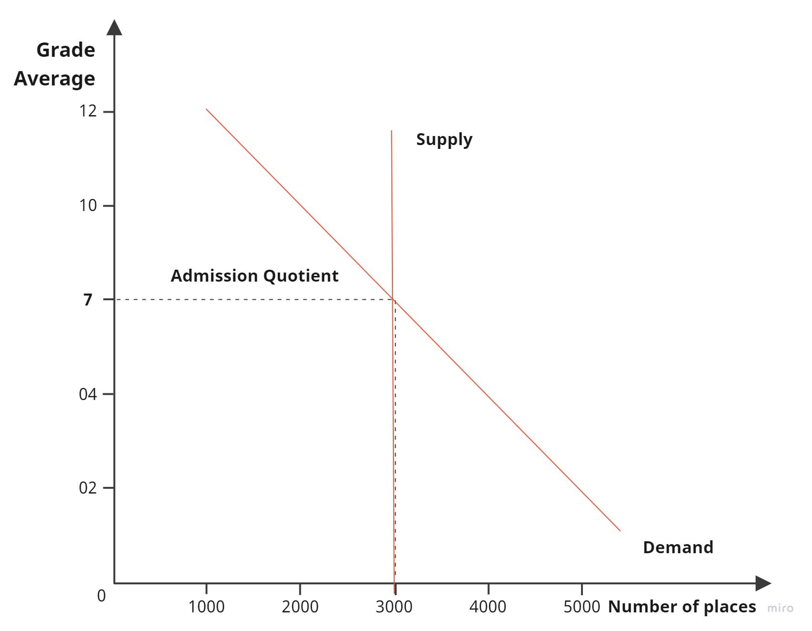
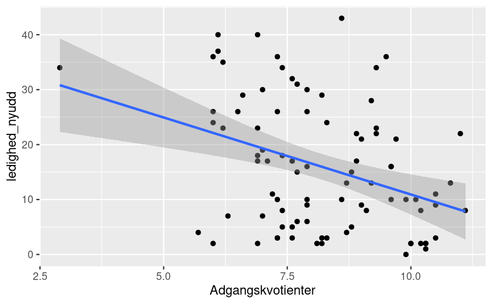
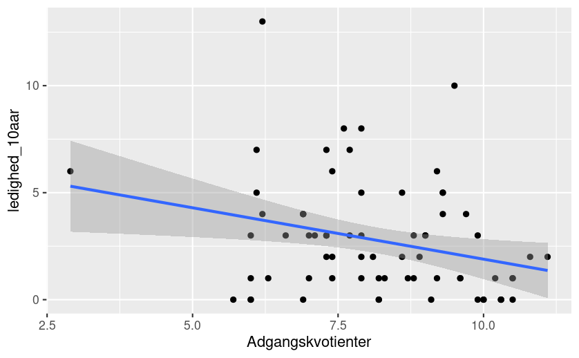
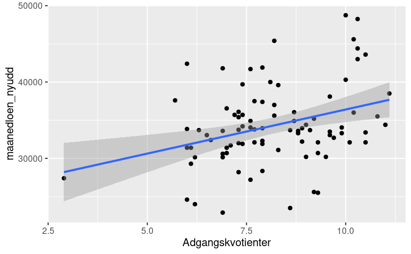
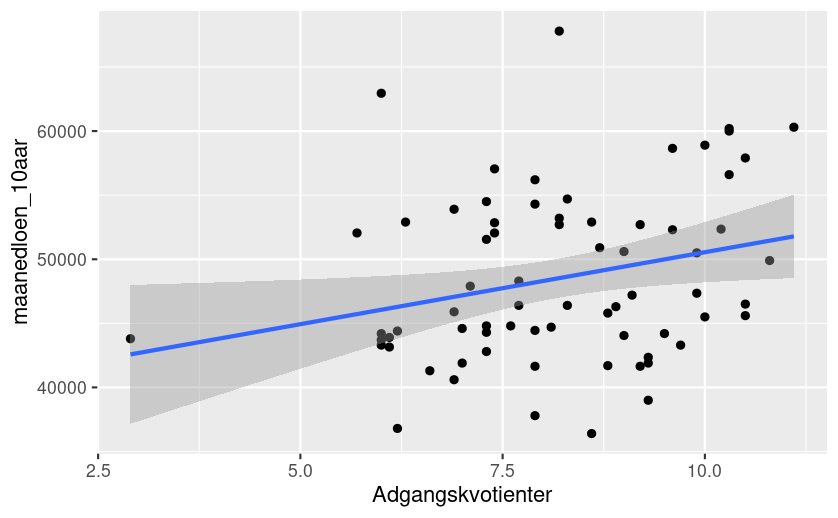
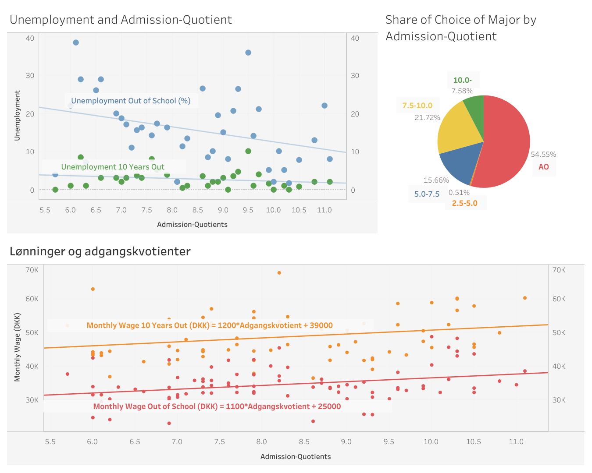

# Is Choice of Major Based on Future Financial Outlook? (Google Data Analytics Capstone Project)
Data analysis project looking at the relationship between admission quotients and future financial outlook in the Danish university system - Google Data Analytics Course, Final Project

## Background

Denmark has a unique university admissions process. Unlike other countries like the UK, which makes students write a personal statement, get a reference from someone etc. admission in Denmark is nearly entirely based on your grade average out of high school. 

While it's probably not an ideal system of admissions as the increasing rat race of grade averages and increasing rates of mental health problems in school seems to suggest, it provides a solid background to test out different theories.

Under this system, if students only made their choice of education based on current data on future earnings for each of them, there should be a perfect positive correlation between the admission quotient (the grade average required to get in) and data on future earnings. We can show this using a supply and demand curve that determines the admission quotient for each education pathway:



The "price" of a choice of major is the resulting admission quotient. Those with the highest grade averages have the highest capacity to "buy" their choice of education first, and if the model holds, that will imply that the highest-earning education has the highest price. The next-best students will flock after the second-highest earning education and so on. The result is the perfect positive correlation between the admission quotients and projected wages. Thus, if it can be shown that that is not the case, we can conclude that students' decision-making is not solely based on financial outlook - yes, a very low bar to clear - and, in case it isn't, hopefully, some hint of the extent it does.

Briefly stated, then, my hypothesis is that people base their choice of major on their expected remuneration. And this, will be supported if there's a strong linear relationship between admission quotients and data on the wages people can reasonably expect to attain from a certain major.

## Cleaning and Retrieval of Data
My hypothesis requires me to collect data on the different choices of major and their different entrance requirements. The dataset found on *https://ufm.dk/uddannelse/statistik-og-analyser/uddannelseszoom* already contains information regarding financial outlook, but it's missing the major's admission quotient. Each education (entry) is listed with a URL to the website where this piece of information can be found through webscraping. Separate datasets for admission quotients do exist, but there is no consistency in how the majors are named, and therefore impossible to do a straightforward .merge/join or VLOOKUP - webscraping, rather than carefully aligning the format, becomes the simpler option (and probably less prone to errors).

The data on future earnings is from surveys collected intermittently. Most survey data, however, contains tiny sample sizes (most of which have n < 20), not to mention a great share of them don't have any data on it at all. So, this limited dataset of ~300 majors is further narrowed down based on the availability of the data, and all numbers, even assuming that it's from a representative sample, are associated with low levels of confidence. Any conclusions drawn on this data have to be done so carefully and will inherently be limited.

#### Modules used
* requests for retrieving HTML pages associated with each URL
* bs4 (BeautifulSoup) for searching through the HTML page and getting the admission quotient slightly easier
* pandas for retrieving data from Excel file into a manageable dataframe, allowing for easier manipulation of the data
* sleep() from time module to avoid sending HTML requests in too rapid a succession


```python
import requests
from bs4 import BeautifulSoup
import pandas as pd
from time import sleep
```

#### About the data
While it's necessary to look at the bachelor's education for the admission quotient, only the "kandidatuddannelse" (Master's) of the same name has information regarding salary expectations. Proceeding to the "kandidatuddannelse" is usually guaranteed following admission in the bachelor of the same name. The implications of this are that, initially, two data frames are created: one for the bachelors from which the admission quotients are retrieved; another for the "Kandidatuddannelse" which will contain the salary and job prospects. Only at the end are they joined where the name is the same - that is, we assume the choice of "kandidatuddannelse" will directly follow from the choice of bachelor of same name. (Note, this mapping is not always possible, and therefore some entries will be lost in the joining of the data frames) 


```python
df = pd.read_excel("ufm_samlet_23jun2022.xlsx")

# the columns used from the spreadsheet
df = df[["Titel", "url", "displaydocclass", "hovedinsttx",\
         "ledighed_nyudd", "maanedloen_nyudd", "ledighed_10aar", "maanedloen_10aar"]]

# df for "kandidatuddannelse" and job and salary prospects. Also, institution and title of education choice for identifier
# Clearing entries where "Uddannelsen på landsplan" as they're just an agglomeration of the other entries when you can take
# the same education at multiple institutions
df_kandidat = df.loc[(df["displaydocclass"] == "Kandidatuddannelse") & (df["hovedinsttx"] != "Uddannelsen på landsplan")]
df_kandidat = df_kandidat[["Titel", "hovedinsttx", "ledighed_nyudd", "maanedloen_nyudd", "ledighed_10aar", "maanedloen_10aar"]]

# df for bachelor's. Only getting url for admission quotients and title and institution for unique identifier
df_bachelor = df.loc[(df["displaydocclass"] == "Bacheloruddannelse") & (df["hovedinsttx"] != "Uddannelsen på landsplan")]
df_bachelor = df_bachelor[["Titel", "url", "hovedinsttx"]]

df_kandidat.reset_index(inplace=True)
df_bachelor.reset_index(inplace=True)
```

#### Webscraping

The goal here is to get an array of the admission quotients, such that it can easily be added as a column later. This requires a 1:1 overlap with the entries, and through trial and error, I found out that storing the titles was useful to ensure that there would be no duplicates in the list. 

The admission quotient is always stored in the same format inside the div with the class "views-row views-row-6", so too creative an endeavour, this webscraping was not.


```python
# Getting quotients from bachelor admission
quotients = []
# storing webscraped education choices to ensure that the same is not cited multiple times
titles_done = []

# iterating through each url (entry)
# iterating through df painfully bad, but.... it was easier
for index, row in df_bachelor.iterrows():
    quotient_temp = []

    fixed_url = "https://" + row["url"]
    r = requests.get(fixed_url)
    try:
        soup = BeautifulSoup(r.text, "html.parser")
        div = soup.find("div", class_="views-row views-row-6")
        table = div.find("table")

        tbody = table.find("tbody")
        trs = tbody.find_all("tr")
        
        
        for tr in trs:
            if tr.find("b"):
                continue
            else:
                tds = tr.find_all("td")              
                sub_counter = 0
                for td in tds:
                    # pattern of every third,
                    # 0 locatoin
                    # 1 average required to get in immediately
                    # 2 average for "standby quotient"
                    if sub_counter % 3 == 1:
                        quotient_temp.append(td.text)

                    sub_counter += 1
                    
        if row["Titel"] not in titles_done:
            quotients.append(quotient_temp)
            titles_done.append(row["Titel"])
            
        sleep(0.2) # -> will take about 300 * 0.2 seconds = 1 minute
        
        
    # # exception if choice of study no longer exists. It will spit out the index number
    # and the data associated with it, such that manual inspection is possible
    except AttributeError: 
        print("Problem with", fixed_url)
        print("Whose index is,", index)
        print(row)
        print("\n")
    
print("Done executing")
        # problems with indexes
        # 141, 161, 222, 327
```

    Problem with https://www.ug.dk/uddannelser/bachelorogkandidatuddannelser/bacheloruddannelser/humanistiskebacheloruddannelser/sprog/portugisiske-og-brasilianske-studier
    Whose index is, 141
    index                                                       1518
    Titel                       Portugisiske og brasilianske studier
    url            www.ug.dk/uddannelser/bachelorogkandidatuddann...
    hovedinsttx                               Københavns Universitet
    Name: 141, dtype: object
    
    
    Problem with https://www.ug.dk/uddannelser/bachelorogkandidatuddannelser/bacheloruddannelser/naturvidenskabeligebacheloruddannelser/biologigeografigeologimv/biokemi-og-molekylaer-biologi
    Whose index is, 161
    index                                                       1549
    Titel                               Biokemi og molekylær biologi
    url            www.ug.dk/uddannelser/bachelorogkandidatuddann...
    hovedinsttx                                 Syddansk Universitet
    Name: 161, dtype: object
    
    
    Problem with https://www.ug.dk/uddannelser/bachelorogkandidatuddannelser/bacheloruddannelser/tekniskvidenskabeligebacheloruddannelser/civilingenioeruddannelser/produkt-og-designpsykologi
    Whose index is, 222
    index                                                       1863
    Titel                                Produkt- og designpsykologi
    url            www.ug.dk/uddannelser/bachelorogkandidatuddann...
    hovedinsttx                                  Aalborg Universitet
    Name: 222, dtype: object
    
    
    Problem with https://www.ug.dk/uddannelser/bachelorogkandidatuddannelser/bacheloruddannelser/tekniskvidenskabeligebacheloruddannelser/civilingenioeruddannelser/elektronik
    Whose index is, 327
    index                                                       2197
    Titel                                                 Elektronik
    url            www.ug.dk/uddannelser/bachelorogkandidatuddann...
    hovedinsttx                                 Syddansk Universitet
    Name: 327, dtype: object
    
    
    Done executing
    

#### Removing old data
A few exceptions emerge and their info is printed out. Upon looking at the four problematic entries, it happens, because the dataset is not fully up-to-date but is a year old: the dataset contains choices one can no longer make. Issues arise with indexes 141, 161, 222, 327, which are dropped from the data frame.

```python
# dropping problematic indexes -> choice of study no longer exists [verified manually]
problematic_indexes = [141, 161, 222, 327]
for i in problematic_indexes:
    df_bachelor.drop(i, inplace=True)
```

#### Adding Admission Quotients
There's still one error with the array of admission quotients: it has a length of 325, whereas the data frame has a length of 324. Somehow, a "Kun kvote 2" string snuck in. 

Beyond that, there's also the question of how to deal with "AO". This means that everyone who applied got in. That's translated to become a 0 in the dataset, as the "price" of getting in is null.


```python
quotient_column = [j for i in quotients for j in i if j != "Kun kvote 2"]
quotient_column = [float(x.replace(",", ".")) if x != "AO" else 0 for x in quotient_column]
df_bachelor = df_bachelor.assign(Adgangskvotienter=quotient_column)
```

#### Merging the Two Data Frames
To address the lack of a common unique identifier that could join the two data frames without error, I opted to create a new one. This one combines the title of the choice of education and the institution in a common format across the two data frames.

After that, they're joined on that column. I also dropped some columns, as they are superfluous. The same goes for duplicate entries that have persisted from the original dataset used. Finally, the data frame is converted into a CSV file so it's ready for R and Tableau.


```python
df_kandidat["Uddannelse"] = df_kandidat["Titel"] + " - " + df_kandidat["hovedinsttx"]
df_bachelor["Uddannelse"] = df_bachelor["Titel"] + " - " + df_bachelor["hovedinsttx"]
df2 = df_bachelor.merge(df_kandidat, left_on="Uddannelse", right_on="Uddannelse")
df2.drop(columns=["Titel_x", "hovedinsttx_x", "index_x", "index_y", "Titel_y", "hovedinsttx_y"], inplace=True)
df2.reset_index(inplace=True)
df2 = df2.drop_duplicates(subset=["Uddannelse", "url"])
df2.to_csv("education_earnings_data.csv", index=False)
```


## Analysing the Data
Going to R now, the goal is to analyse any potential relationship between the admission quotient and,
* Wages right after the education
* Wages 10 years later
* Unemployment rate right after the education
* Unemployment rate 10 years later

Looking at the correlation coefficient and the R-Squared value of the linear regression analysis should tell us how strong the relationships between the variables are.

#### Loading the Libraries and the Data
Using tidyverse is sufficient.
```{r libraries, echo=FALSE}
install.packages("tidyverse")
library(tidyverse)
```

#### Loading the Data and some Filtering
After the extensive processing of the data in Python, there's not much left to do. I wasn't super satisfied with the way "AO" was handled, so I'm filtering those entries out.

```{r data, echo=FALSE}
df <- education_earnings_data
df <- filter(df, Adgangskvotienter != 0)
```

#### Linear Regression Models
Analysing the different relationships provides the following results:
(Note, an additional filter function is called to only look at those entries that contain a value for the studied column. Also, the wages are in the currency DKK (Danish Kroner) and unemployment in %)

**Unemployment right out of school and admission quotients:**

* Linear model (level-level): *Unemployment out of School = -2.8 \* admission_quotient + 39*
* R-Squared: 0.12
* Correlation Coefficient (r): -0.36
```{r pressure, echo=FALSE}
df1 <- filter(df, ledighed_nyudd != "NA")
lm1 <- lm(ledighed_nyudd ~ Adgangskvotienter, data = df1)
cor(df1$ledighed_nyudd, df1$Adgangskvotienter)
summary(lm1)
ggplot(data = df1, aes(x = Adgangskvotienter, y = ledighed_nyudd)) +
  geom_point() + geom_smooth(method=lm)
```


**Unemployment 10 years after school and admission quotients:**

* Linear model (level-level): *Unemployment 10 years out = -0.48 \* admission_quotient + 6.7*
* R-Squared: 0.068
* Correlation Coefficient (r): -0.28

```{r pressure, echo=FALSE}
df2 <- filter(df, ledighed_10aar != "NA")
lm2 <- lm(ledighed_10aar ~ Adgangskvotienter, data = df2)
cor(df2$ledighed_10aar, df2$Adgangskvotienter)
summary(lm2)
ggplot(data = df2, aes(x = Adgangskvotienter, y = ledighed_10aar)) +
  geom_point() + geom_smooth(method=lm)
```


**Wages out of school and admission quotients:**

* Linear model (level-level): *Wages out of school (kr) = 1200 \* admission_quotient + 25000*
* R-Squared: 0.10
* Correlation Coefficient (r): 0.33
```{r pressure, echo=FALSE}
df3 <- filter(df, maanedloen_nyudd != "NA")
lm3 <- lm(maanedloen_nyudd ~ Adgangskvotienter, data = df3)
cor(df3$maanedloen_nyudd, df3$Adgangskvotienter)
summary(lm3)
ggplot(data = df3, aes(x = Adgangskvotienter, y = maanedloen_nyudd)) +
  geom_point() + geom_smooth(method=lm)
```


**Wages 10 years out and admission quotients:**

* Linear model (level-level): *Wages 10 years out (kr) = 1100 \* admission_quotient + 39000*
* R-Squared: 0.056
* Correlation Coefficient (r): 0.26
```{r pressure, echo=FALSE}
df4 <- filter(df, maanedloen_10aar != "NA")
lm4 <- lm(maanedloen_10aar ~ Adgangskvotienter, data = df4)
cor(df4$maanedloen_10aar, df4$Adgangskvotienter)
summary(lm4)
ggplot(data = df4, aes(x = Adgangskvotienter, y = maanedloen_10aar)) +
  geom_point() + geom_smooth(method=lm)
```


## Tableau Dashboard



## Conclusions
None of the above models show any strong relationships. All r-levels are below 0.4 and R-Squared does not even stretch as far as 0.20. This seems to justify a rejection of the original hypothesis: no, the choice of study does not solely depend on projected wages. A higher admission quotient does not mirror high projected earnings and is probably a function of far more than just earnings.

What's interesting is to see that the level of correlation decreases with time, and this is mirrored in both metrics of wages and unemployment. Right out of school there's a stronger correlation between admission quotient and wages/unemployment than 10 years out. This seems to make intuitive sense: as people have more experience in the job market, the importance of their education lessens.

One thing is for sure: if someone only cares about their remuneration and likelihood of getting a job, one's admission quotient truly doesn't matter. At least in Denmark.

## Limitatations
All of the above conclusions are drawn on an insufficient data foundation and should thus not be taken very seriously. Beyond that, however, there are still some improvements that could be made to the analysis. 

For convenience, I omitted that admission is not solely based on grade averages. For some majors, there's the ability to seek admission through so-called "Kvote 2" which looks at factors beyond one's high school grades. This rarely makes up a very large share of admission, so it shouldn't matter too much, but it does definitely distort the model of supply and demand. Furthermore, such a supply and demand curve only models the real world assuming agents have perfect information and that's definitely not the case here: students do not know what the admission quotients will be next year and they only have a limited amount of choices. The factors listed above undermine the picture painted in the background section, but it seems infinitely improbable that the lack of correlation is because of these minor issues.

Filtering out the "AO" data also reduces the data unnecessarily - I just simply couldn't figure out how to handle it better. No matter what I tried, it looked awkward on the data visualisations and provided some funky results.

Maybe studying a log-level model yields better results than a level-level one? Instead of yielding a fixed amount extra in wages as modelled here, an increase of one in the admission quotient could instead increase wages by 1%.

## Outlook for the Future
Other than improving the above, this project still feeds into some interesting, potential questions.

Including the "Professionsbachelors" in the analysis would require little work and it would be interesting. It would allow me to compare wage outlooks for those that go the very traditional university path, and those looking to get into a job earlier with a shorter education. Granted, they are shorter, so it's to be expected that wage outlooks are lower.

Also, if predicting wages is more interesting, separating data based on educational field (i.e. something like the Humanities vs. the Hard Sciences) and/or institution is probably more insightful.

Looking at some of the other metrics available in the dataset and their relationships to admission quotients could yield better results. Even a multivariable analysis, maybe. If financial outlook is not a good predictor of where demand far outstrips supply (that is, where admission quotients are higher) maybe something like expected stress levels and quality of social life is (yes, truly all kinds of information are contained in that dataset - perhaps also an indicator of poor quality due to a possibility of "question saturation"?)

## What I've Learned from this Project
Despite being an amateur data analyst's completely unsuccessful venture at something resembling a mini-research project, it has felt worthwhile because of the skills I've practised during it. Putting skills to practical use differs greatly from grasping concepts theoretically in an online course, and while the course prepared me to undertake this project and the basics of each program, I still had to look beyond it a lot during this project.

I feel as though I have learned/improved on,
* Cleaning data using Pandas in Python
* Webscraping in Python
* Manipulating data in Pandas
* Using R for original statistical analysis
* Crafting data visualisations using R and Tableau
* Using Excel to get an overview of data (Filtering, sorting, pivot tables etc.)
* Using Jupyter Notebooks and R Studio to make a comprehensive report on Data Analysis Projects

There are still obvious things I need to improve on: the original hypothesis and theory were poorly drafted and could definitely have used some work before starting on this project. Practice too. A seasoned data analyst could probably have done all of this within a few hours, but here I am, having spent nearly 20 hours on it. Wrapping my head around the process, conceptualising it, took longer than expected, but having done this I think it'll go a lot faster next time.

#### Thanks for Reading


